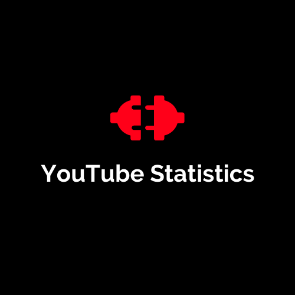

[![Contributors][contributors-shield]][contributors-url]
[![Forks][forks-shield]][forks-url]
[![Stargazers][stars-shield]][stars-url]
[![Issues][issues-shield]][issues-url]
[![MIT License][license-shield]][license-url]
[![LinkedIn][linkedin-shield]][linkedin-url]

<br />
<p align="center">
  <a href="https://github.com/HarshaAbeyvickrama/YouTube-Statistics.git">
    
  </a>

  <h3 align="center">YouTube Statistics</h3>

  <p align="center">
    YouTube Statistics Analyzer
    <br />
    <a href="https://github.com/HarshaAbeyvickrama/YouTube-Statistics/"><strong>Explore the docs »</strong></a>
    <br />
    <br />
    <!-- <a href="https://github.com/HarshaAbeyvickrama/YouTube-Statistics">View Demo</a> -->
    ·
    <a href="https://github.com/HarshaAbeyvickrama/YouTube-Statistics/issues">Report Bug</a>
    ·
    <a href="https://github.com/HarshaAbeyvickrama/YouTube-Statistics/issues">Request Feature</a>
  </p>
</p>


<!-- TABLE OF CONTENTS -->
<details open="open">
  <summary><h2 style="display: inline-block">Table of Contents</h2></summary>
  <ol>
    <li>
      <a href="#about-the-project">About The Project</a>
      <ul>
        <li><a href="#built-with">Built With</a></li>
      </ul>
    </li>
    <li>
      <a href="#getting-started">Getting Started</a>
      <ul>
        <li><a href="#Spreadsheet-setup">Spreadsheet setup</a></li>
        <li><a href="#YouTube-Advanced-Service-setup">YouTube Advanced Service setup</a></li>
        <li><a href="#Making-a-local-copy">Making a local copy</a></li>
        <li><a href="#Apps-Script-trigger-setup">Apps Script trigger setup</a></li>
      </ul>
    </li>
    <li>
      <a href="#usage">Usage</a>
      <ul>
        <li><a href="#Functions">Functions</a></li>
        <li><a href="#CORS-Error">CORS Error</a></li>
      </ul>
    </li>
    <li><a href="#roadmap">Roadmap</a></li>
    <li><a href="#contributing">Contributing</a></li>
    <li><a href="#license">License</a></li>
    <li><a href="#contact">Contact</a></li>
    <li><a href="#acknowledgements">Acknowledgements</a></li>
  </ol>
</details>


<!-- ABOUT THE PROJECT -->
## About The Project

<!-- [![Product Name Screen Shot][product-screenshot]](https://example.com) -->

YouTube Statistics is a project created to analyze YouTube videos and channels. This project can monitor the changes in views , likes, comments of a youtube video or new video uploads of a channel added to the database or the videos of the user uploads. This project is created in the purpose of automating the reseach work done around youtube statistics.

<i>You can use this project freely and contribute to make it better</i>

### Built With

* [Google Apps Script](https://www.google.com/script/start/)
* [YouTube Data API V3](https://developers.google.com/youtube/v3)
* [Google Sheets API V4](https://developers.google.com/sheets/api)


<!-- GETTING STARTED -->
## Getting Started

To get a local copy up and running follow these simple steps.

### Spreadsheet setup

1. Make of copy of the spreadsheet <a href="" class="button primary">here</a>. It already contains the Apps Script code from this repository.
2. Change the name of the Project to aything you want.

### YouTube Advanced Service setup

1. From the spreadsheet, open the script editor by selecting Extensions > Apps Script.
2. In the left-hand navigation pane, select + next to Services.
3. Choose the YouTube Data API service, and click Add.
4. Then Choose the Google Sheets API service, and click Add.

### Making a local copy

Clone the YouTube-Statistics
```sh
  git clone https://github.com/HarshaAbeyvickrama/YouTube-Statistics.git
```

### Apps Script trigger setup

1. From the script editor, navigate to the left-hand vertical toolbar, and choose Triggers.
2. In the bottom right-hand corner, click the +Add Trigger button.
3. Under Run, select the `updateVideoStatsTrigger` function.
4. Under Select event source, choose Time-driven.
5. Under type, select Hour timer.
6. Then select Every Hour. (<i>This will run every hour of the day and update the view,like & comment count of videos</i>)
7. Optionally, adjust the Failure notification settings to configure how and when you are contacted by email if your triggered function fails.
8. Click Save.
9. Repeat from step 3 to 8 for the triggers `updateChannelVideoStatsTrigger` , `updateUserChannelTrigger` & `updateChannelsTrigger `.
10. For `updateUserChannelTrigger` & `updateChannelsTrigger `  use a weekly trigger.
<!-- USAGE EXAMPLES -->
## Usage

### Functions

1. `addUserVideos()` :    <i>Add your uploads to the sheet to track.</i>
2. `getUserVideos()` :  <i>Returns a JSON response of all user uploaded videos.</i>
3. `addPublicVideo(url,type)` :   <i>Add a video with the link to the sheet to track.</i>
4. `getPublicVideos()` :  <i>Returns a JSON response of all videos that are added to the sheet with addPublicVideo() function</i>
5. `getVideoStats(videoID)` :   <i>Returns a JSON response of a particular video that is currently available in the database</i>
6. `addNewChannel(ChannelLink)` :   <i>Add a YouTube channel to the sheet to monitor. This function will add all videos in that channel to the database and it will monitor their views, comments & like count seperately.</i>
7. `getChannel(channelID)` :   <i>Returns a JSON response with the details a particular channel</i>

<strong>Here,  a separate sheet will be created with the name of the video ID for every video added to the sheet. This is applicable for all user videos and addition of channels<strong>

8. `resetDatabse()` :   <i>Reset the database by clearing all the records in the main sheets and deleting all the extra sheets created for channels.</i>

### CORS Error

If you get a CORS error in your console you can fix that by following the below steps

1. Create a new folder anywhere you want
2. Copy the absolute path of that newly created folder
3. Replace the `path\to\your\folder` with the path you just copied in `runChrome.bat` file.
4. Then double click that `runChrome.bat` file and it will open a chrome window in `web security diabled` mode.There will a warning in the top of the browser. Just ignore that ☺
5. You are good to go !

<!-- ROADMAP -->
## Roadmap

See the [open issues](https://github.com/HarshaAbeyvickrama/YouTube-Statistics/issues) for a list of proposed features (and known issues).


<!-- CONTRIBUTING -->
## Contributing

Contributions are what make the open source community such an amazing place to be learn, inspire, and create. Any contributions you make are **greatly appreciated**.

1. Fork the Project
2. Create your Feature Branch (`git checkout -b feature/AmazingFeature`)
3. Commit your Changes (`git commit -m 'Add some AmazingFeature'`)
4. Push to the Branch (`git push origin feature/AmazingFeature`)
5. Open a Pull Request


<!-- LICENSE -->
## License

Distributed under the MIT License. See `LICENSE` for more information.


<!-- CONTACT -->
## Contact

Harsha Abeyvickrama - [@VHAbeyvickrama](https://twitter.com/VHAbeyvickrama) - harshaabeyvickrama@gmail.com

Project Link: [https://github.com/HarshaAbeyvickrama/YouTube-Statistics](https://github.com/HarshaAbeyvickrama/YouTube-Statistics)


<!-- ACKNOWLEDGEMENTS -->
## Acknowledgements

* [Virange Gunarathne](https://www.linkedin.com/in/viranga-gunarathna-3322981a5/)
* [Awantha Irushan](https://www.linkedin.com/in/avantha-irushan-b68792191/)


<!-- MARKDOWN LINKS & IMAGES -->
<!-- https://www.markdownguide.org/basic-syntax/#reference-style-links -->
[contributors-shield]: https://img.shields.io/github/contributors/HarshaAbeyvickrama/YouTube-Statistics.svg?style=for-the-badge
[contributors-url]: https://github.com/HarshaAbeyvickrama/YouTube-Statistics/graphs/contributors
[forks-shield]: https://img.shields.io/github/forks/HarshaAbeyvickrama/YouTube-Statistics.svg?style=for-the-badge
[forks-url]: https://github.com/HarshaAbeyvickrama/YouTube-Statistics/network/members
[stars-shield]: https://img.shields.io/github/stars/HarshaAbeyvickrama/YouTube-Statistics.svg?style=for-the-badge
[stars-url]: https://github.com/HarshaAbeyvickrama/YouTube-Statistics/stargazers
[issues-shield]: https://img.shields.io/github/issues/HarshaAbeyvickrama/YouTube-Statistics.svg?style=for-the-badge
[issues-url]: https://github.com/HarshaAbeyvickrama/YouTube-Statistics/issues
[license-shield]: https://img.shields.io/github/license/HarshaAbeyvickrama/YouTube-Statistics.svg?style=for-the-badge
[license-url]: https://github.com/HarshaAbeyvickrama/YouTube-Statistics/blob/master/LICENSE.txt
[linkedin-shield]: https://img.shields.io/badge/-LinkedIn-black.svg?style=for-the-badge&logo=linkedin&colorB=555
[linkedin-url]: https://linkedin.com/in/harshaabeyvickrama
